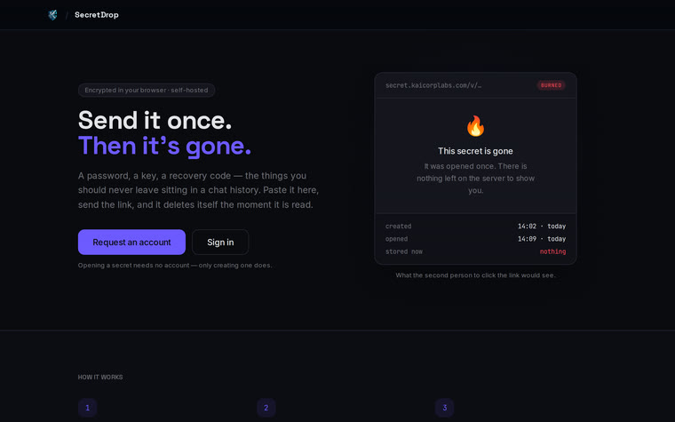

# SecretDrop

**Share a secret once.** Encrypted in the browser before it leaves, burned the moment it is read. Self-hosted.

[](https://github.com/Ulzuhan/secretdrop/actions/workflows/ci.yml)
[](https://github.com/Ulzuhan/secretdrop/pkgs/container/secretdrop)
[](LICENSE)



Passwords, API keys and one-off credentials do not belong in chat history or email threads. SecretDrop turns them into a link that works exactly as many times as you allow — once, by default — and then destroys itself.

## Security model

The server never sees the plaintext — not even with full disk access:

1. The secret is encrypted **in the browser** with AES-256-GCM under a random 256-bit key (Web Crypto API, `src/lib/crypto.ts`).
2. The key travels in the **URL fragment** — `/v/<id>#<key>` — which browsers never send to servers.
3. The server stores only the ciphertext, the IV and the metadata (expiry, view budget).
4. Opening the link fetches the ciphertext, and the browser decrypts it locally with the key from the fragment.

Same security model as OneTimeSecret, Yopass or PrivateBin.

## Burn semantics

- **View budget** — 1 to 10 views, default 1. The view that exhausts the budget writes a durable tombstone with no ciphertext before returning it; a burned or expired link answers `410`, never the ciphertext again.
- **Expiry** — 1 hour to 7 days, default 24 h. Expired secrets are removed on access, at process startup, and by `POST /api/cleanup`.
- **Storage** — flat files under `.secretdrop-store/` with an in-memory cache in front. No database required.

## Who can do what

The asymmetry is the whole design: **creating a secret needs an account, opening one does not.** Whoever you send a link to is, by definition, somebody without an account here — asking them to get one would defeat the point of the tool. Sign-in (OIDC, e.g. against Authentik) guards the writing side only; `/v/<id>` stays open to anyone holding the link. There is no user store: a session is just a signed cookie carrying the identity the OIDC provider vouched for.

## Quickstart

```bash
npm ci
npm run dev        # http://localhost:3461
```

Until OIDC is configured nobody can sign in to create secrets — set the variables below.

## Environment variables

| Variable | Purpose |
|---|---|
| `SECRETDROP_SESSION_SECRET` | HMAC key that signs the session cookie. Without it (and an OIDC client), nobody can sign in. |
| `SECRETDROP_OIDC_CLIENT_ID` / `_SECRET` | OIDC client credentials. |
| `SECRETDROP_OIDC_REDIRECT_URI` | Must match one of the URIs registered in the provider. |
| `SECRETDROP_OIDC_PUBLIC_BASE` | The provider as the browser sees it. |
| `SECRETDROP_OIDC_INTERNAL_BASE` | The provider as this server sees it — redeeming the authorization code never leaves the internal network. |
| `SECRETDROP_SESSION_TTL_HOURS` | Signed-session lifetime; default 12 h, clamped to 1–24 h. |
| `SECRETDROP_OIDC_TIMEOUT_MS` | OIDC network timeout; default 10 s. |
| `SECRETDROP_MAX_STORE_BYTES` | Total on-disk quota; default 100 MiB. |
| `SECRETDROP_MAX_ACTIVE_SECRETS` | Active-secret quota; default 1000. |
| `SECRETDROP_STORE_DIR` | Where secrets live. Defaults to `.secretdrop-store` next to the code. Configurable so the test suite does not write into the real store — before it existed, every run left its own secrets mixed in with people's, under the same automatic cleanup. |
| `SECRETDROP_PUBLIC_HOST` | Public hostname the origin check compares against. Unset, the incoming `Host` is used, which is right behind a tunnel that preserves it — verified. Only needed behind a proxy that rewrites `Host` with an internal name. |

## Production deployment

See [`DEPLOYMENT.md`](DEPLOYMENT.md). Run one application process behind a TLS reverse proxy; in-process locks, quotas and rate limits are not distributed. Do not back up the payload store, because restoring it can resurrect data that should have expired.

## Tests

```bash
npm test           # unit tests, then the HTTP suites
npm run test:unit  # just the pure functions
npm run test:http  # just the suites, needs a build first
```

The unit tests cover the two functions that were **actually broken** when this
service was audited — the id validation and the range clamp — plus the one that
holds the whole promise together: two requests arriving at once for the same secret
have to be talking about the same object. If each gets its own copy, each keeps its
own view count, all of them think they are the first, and a one-time secret goes out
to all of them. That was proven real by widening the window on purpose: **thirty
readers, thirty copies of a single-use secret**.

The HTTP suites start their own server with its own store. `test-auth` is the door;
`test-secretos` is the promise — read once and no more, expiry, the caps, and the
identifier that comes from the URL.

That last one is worth a note. The suite drops **two decoys outside the store**, one
expired and one live, because the obvious version of the test proved nothing: asking
for `../../etc/passwd` returns 404 whether the validation is there or not, since
there is no `meta.json` behind it. With a real file on the other side, removing the
validation shows both halves of what was once a live vulnerability — the live decoy
gets read, and the expired one gets **deleted**.

## API

| Route | Auth | Purpose |
|---|---|---|
| `POST /api/secrets` | account | Store ciphertext + IV; returns the id. |
| `GET /api/secrets` | account | List live secrets on this instance (metadata only, never ciphertext). |
| `GET /api/secrets/:id` | none | Fetch ciphertext + IV; counts toward the view budget. |
| `POST /api/cleanup` | account | Purge expired and burned secrets. |

## Stack

Next.js 16 · React 19 · TypeScript. No runtime dependencies beyond Next itself — the crypto is the platform's.
